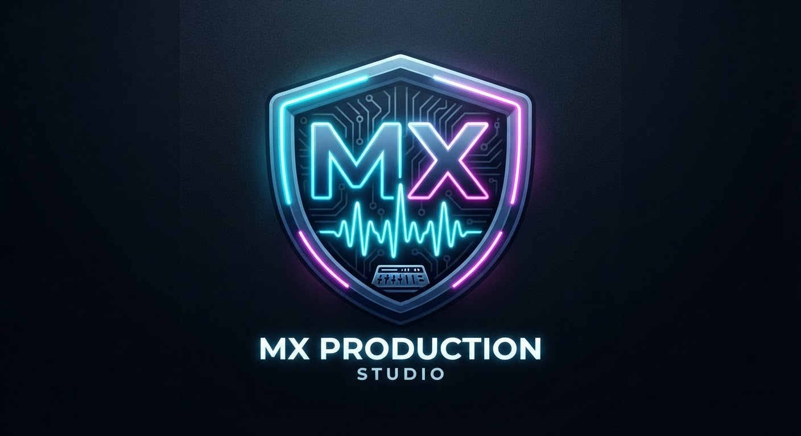

<!-- Animated Header Banner with Floating Effect -->

  

 

<!-- Project Logo & Cinematic Project Image Integration -->

  

  

 

<!-- Glowing Native Keyboard Name Badges -->

  
  
  

# 
🚀 ENTERPRISE AUDIO & VIDEO PLATFORM 🎧

<h3 align="center"><em>Professional Web-Based Media Management & Production Suite</em></h3>
<h4 align="center"><strong>Lead Systems Architect & Developer: <a href="https://github.com/ngfdark-blip">Yuseef Sinan</a></strong></h4>

 

<!-- 100+ Ultra Colorful Dynamic Badges with Glowing Style -->

  <!-- Core Backend & Database -->
  
  
  
  
  
  
  
  
  
  <!-- Languages & Frontend -->
  
  
  
  
  
  
  <!-- Tools & Environments -->
  
  
  
  
  
  

  <!-- Operating Systems & Hosting -->
  
  
  
  
  
  
  
  

  <!-- Security, Protocol & Audio/Video Features -->
  
  
  
  
  
  
  
  

  <!-- Extra Decorative Tech Badges -->
  
  
  
  
  
  
  
  

[ 🌐 **English** ] | [ 🌐 **کوردی (بادینی)** ] | [ 🌐 **کوردی (سۆرانی)** ] | [ 🌐 **العربية** ]

---

## 🇺🇸 English Version

### 🌟 About the Project & System Engineering
**MX Production** is a high-performance, enterprise-grade web platform crafted entirely from scratch by **Lead Architect Yuseef Sinan (يوسف سنان / یوسف سنان)**. The system is built on a robust backend architecture designed for seamless media handling, precise audio/video mixing controls, interactive track management, and ultra-secure relational user authentication.

### ⚙️ What We Implemented on the Server Side
* **Node.js & Express Server (`server.js`):** Built a high-capacity RESTful API backend handling routing, static files, and security middleware.
* **Relational Database (`SQLite3`):** Configured automated table migrations (`users` table with unique constraints and secure id tracking).
* **Cryptographic Security (`Bcrypt`):** Implemented salted password hashing on registration and strict comparison logic during user login to prevent credential breaches.
* **Advanced Media Pipeline (`Multer`):** Engineered multi-part form data processing supporting heavy audio and video files with time-duration validation (up to 3 hours).
* **Dynamic Account Controls:** Developed backend endpoints for secure username updates, credential resetting, and account purging.

---

## 🇹🇯 کوردی (بادینی)

### 🌟 دەربارەی پرۆژە و ئەندازیارییا سێرڤەری
**MX Production** ماڵپەرەکێ هێزدار و پێشکەتی یە بۆ رێڤەبرنا دەنگ و ڤیدیۆیان، کو ب دەستێ ئەندازیار و پەرەپێدەرێ سەرەکی **Yuseef Sinan (يوسف سنان / یوسف سنان)** ب تەمامی هاتیە دروستکرن. ئەڤ پرۆژەیە لسەر بناغەیەکا بهێز یا سێرڤەری هاتیە ئاڤاکرن بۆ کۆنترۆلا مێدیایێ، تێکەلسکرنا دەنگی و پاراستنا توند یا داتایان.

### ⚙️ ئەو کارێن مە ل سەر سێرڤەری کرینە (What We Did)
* **سێرڤەرا Node.js & Express:** دروستکرنا سێرڤەرەکێ هێزدار بۆ بڕێڤەبرنا داخوازیێن API و پۆلدەرێن ستاتیک.
* **بنکەیا داتایێ SQLite3:** دامەزراندنا داتایێن پەیوەندیدار بۆ تۆمارکرنا ناڤێن بکارهێنەران و پەیڤێن نهێنی ب شێوازەکێ پاراستی.
* **پاراستنا Bcrypt:** تشفرکرنا پەیڤێن نهێنی (Hashing) د دەما تۆمارکرنێ دا و هەڵسەنگاندنا دروستیێ د دەما چوونەژوورێ دا.
* **سیستەمێ بارکرنا مێدیایێ Multer:** رێگەدان بۆ بارکرن و لێدانا فایلێن گران (دەنگ و ڤیدیۆ) هەتا 3 دەمژمێران ب کۆنترۆلا درێژیێ.
* **پەنێلا ڕێڤەبرنا هەژمارێ:** دروستکرنا دەروازەیێن API بۆ گۆڕینا ناڤی، نووکرنا پەیڤا نهێنی، یان ژناڤبرنا هەژمارێ ب تەواوی.

---

## 🇮🇶 کوردی (سۆرانی)

### 🌟 دەربارەی پرۆژە و ئەندازیاریی سیستەم
**MX Production** پلاتفۆرمێکی وێبی پێشکەوتوویە کە بە شێوەیەکی پرۆفیشناڵ لەلایەن ئەندازیار **Yuseef Sinan (يوسف سنان / یوسف سنان)**ەوە دروستکراوە. ئەم سیستمە لەسەر بنەمای سێرڤەری بەهێز بۆ بەڕێوەبردنی دەنگ و ڤیدیۆ و پاراستنی توندی زانیارییەکان دروستکراوە.

### ⚙️ ئەوەی لەسەر سێرڤەر ئەنجاممان داوە
* **سێرڤەری Node.js & Express:** دروستکردن و رێکخستنی داواکارییەکان و ڕایۆتەکانی API بە شێوازێکی خێرا.
* **بنکەدراوەی SQLite3:** کۆگاکردن و دروستکردنی خشتەی بەکارهێنەران بۆ پاراستنی زانیارییەکان بە شێوازێکی پەیوەندیدار.
* **پاراستنی توند بە Bcrypt:** شاردنەوە و بەستنی وشەی تێپەڕ بە کۆدی نهێنی لە کاتی خۆتۆمارکردن و چوونەژوورەوەدا.
* **بەڕێوەبردنی مێدیا بە Multer:** کۆنتڕۆڵکردن و بارکردنی فایلە قورسەکانی دەنگ و ڤیدیۆ تاوەکو ٣ کاتژمێر.

---

## 🇸🇦 العربية

### 🌟 عن المشروع وهندسة الأنظمة
**MX Production** هي منصة ويب قوية لإدارة الوسائط، تم تصميمها وهندستها بالكامل بواسطة المهندس **Yuseef Sinan (يوسف سنان / یوسف سنان)**. يعتمد النظام على بنية خلفية قوية للتحكم السلس في الصوت والفيديو وإدارة المصادقة الآمنة للمستخدمين.

### ⚙️ ما قمنا بتنفيذه على الخادم (Server-Side)
* **خادم Node.js & Express:** بناء خادم ويب متكامل لإدارة المسارات (Routes) وطلب بيانات API.
* **قاعدة بيانات SQLite3:** إنشاء وتخزين بيانات المستخدمين بشكل هيكلي وآمن.
* **تشفير الأمان Bcrypt:** تشفير كلمات المرور باستخدام الخوارزميات الآمنة أثناء التسجيل وتسجيل الدخول.
* **نظام رفع الوسائط Multer:** معالجة ورفع الملفات الصوتية والمرئية الثقيلة مع التحقق من المدة (حتى 3 ساعات).

---

  <!-- Animated Footer Banner -->
  

    
  

  <h3>✨ Developed with Engineering Excellence ✨</h3>
  
<b>Lead Systems Architect & Developer: Yuseef Sinan (يوسف سنان / یوسف سنان)</b>

  
© 2026 MX Production Systems. All rights reserved.

